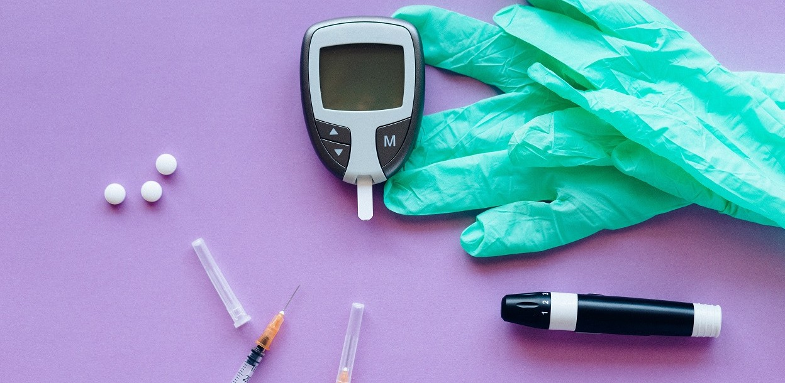

# 🤖 Workshop-COF-23: Cómo entrenar a tu modelo de Deep Learning desde cero 🚀

## 🪧 Descripción

¡Hola! En este repositorio encontrarás todo el material necesario para el workshop sobre Deep Learning del Hackaton-COF del 5 de octubre de 2023.

## 🗃️ Índice
- [🤖 Workshop-COF-23: Cómo entrenar a tu modelo de Deep Learning desde cero 🚀](#-workshop-cof-23-cómo-entrenar-a-tu-modelo-de-deep-learning-desde-cero-)
  - [🪧 Descripción](#-descripción)
  - [🗃️ Índice](#️-índice)
  - [📚 Contenido](#-contenido)
  - [👥 Agradecimientos](#-agradecimientos)
  - [📝 Licencia](#-licencia)

## 📚 Contenido

Todas las prácticas están pensadas para que no sea necesario instalar nada en el ordenador personal. Para ello, haremos uso de Google Colab, una herramienta que nos permite ejecutar código Python en la nube.Solo necesitaremos una cuenta de Google.

* **Prácitca 1: [Diagnóstico de diabetes](Practica1_diabetes.ipynb)**
Empezamos con una práctica sencilla pero muy útil, donde construiréis, componente a componente, una sencilla red neuronal para no menos que diagnosticar diabetes. ¡Vamos allá!

* **Prácitca 2: [Amazon_XRay - quién es quién](Practica2_VGG_X_Ray.ipynb)**

Es el momento de trabajar con imágenes. Si tienes problemas reconociendo actores y actrices y siempre tienes que recurrir al X-Ray de Prime video, te echamos un cable. Vamos a construir una red neuronal para clasificar imágenes de actores y actrices. Te chivaremos el nombre.

* **Prácitca 3: [El Mario Party le gusta hasta a las IAs](Practica3_goomba_detector.ipynb)**

Por último, vamos a construir una red neuronal para detectar Goombas y bombas en el Mario Party. Cada uno entrenará su propio modelo y luego los pondremos a jugar haciendo uso de un [segundo repositorio](https://github.com/LoboaTeresa/AI-Mario-Party). ¿Quién será el mejor? ¡A por ello!

## 👥 Agradecimientos
Muchas gracias a [Ceuta Open Future](https://ceuta.openfuture.org/) por organizar cada año el #HackatonCOF y por haber contado conmigo para los talleres de esta edición. Me gustaría mandar una mención especial a [Diego Ewokcillo](https://github.com/ewokcillo) y a [Paola Castaño](https://www.linkedin.com/in/paolacbarroso/?originalSubdomain=es). ¡Gracias por todo!

## 📝 Licencia

[MIT License](./LICENSE)